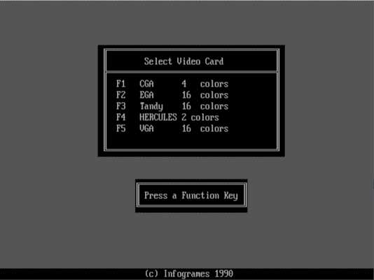
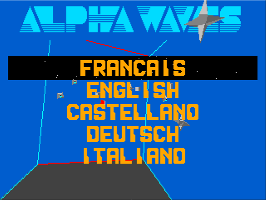

# alpha_waves_loader

This is the reverse engineered the english-language text menu game loader ALPHA_E.COM of the DOS game Alpha Waves aka Continuum

Loader menu | Game intro
--- | ---
 | 
 
- Youtube: https://www.youtube.com/watch?v=jN9KKnfwoNY
- AlphaWaves on moby: https://www.mobygames.com/game/dos/continuum
- Archive.org Floppy-Image download: https://archive.org/details/002297-AlphaWaves (my work bases on this floppy image, unpack disk image with 7zip)

ALPHA_E.COM MD5: 7e165fc5fd1aec1482bc915ab4053d36

# Files:

| File              | Info                                                                                                   |
| :---------------- | :----------------------------------------------------------------------------------------------------- |
| ALPHA_E.idb       | IDA 6.5x IDB of ALPHA_E.COM                                                                            |
| ae.asm            | reversed and reassemble-able source code of ALPHA_E.COM                                                |
| build.bat         | builds ae.asm with UASM64/WLink and checks if resulting ae_org.com is binary identical to ALPHA_E.COM  |
| tools_howto.txt   | how to get the needed build tools (UASM, WLink) - very easy to install                                 |
| ae_org.com        | ae.asm build as-is needs to be binary identical to ALPHA_E.com                                         |
| ae.com            | ae.asm build with DIRECT_START, direct start of the game, no menu, unused code NOPed out               |

 **tools_dir** variable in build.bat needs to be set to suits your environment
 
 # using IDA
 1. add more information to the IDB
 2. produce ASM file in IDA (called ALPHA_E.asm)
 3. merge changes of ALPHA_E.asm into ae.asm
 4. test if resulting ae_org.com is equal to ALPHA_E.COM using build.bat
 
 # DONE
 - reverse/reassemble to binary equal com program
 - analysed the config.tat and HIGHSCOR.QB fully
 - documented the video-card detection, menu and config.tat reading code
 - created a reduced version that gets rid of the video card detection and menu (NOPed out) which directly starts the game
 
 # TODOs
 - there are still non-symbolic offsets or something in the game-start code - the loader crashes if i remove the NOPed parts completely
 - game-starting analyse is in the very beginning: so far: an exe gets created from parts of progs1.cc in ram and executed 
 - rewrite the loader in C and write a tool that directly creates a full game exe that can be directly started (i know i can just memdump, but thats not my goal)
 - maybe reverse AlphaWaves itself - its a Turbo C 2.x exe
